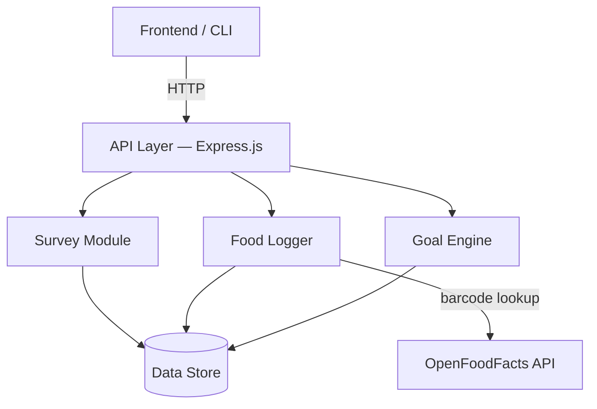

# Design & Architecture v1 — CALTRC

## Overview

CALTRC is a calorie-tracking application designed for people who want to improve their health but find traditional food logging tedious. Users complete a short health survey, receive a personalized daily calorie/macro goal, and then log food intake by scanning barcodes or entering data manually. The app automatically tallies consumption against the daily goal.

---

## Architecture Diagram



**Data flow:**
1. The **Frontend** sends HTTP requests to the **API Layer**.
2. The **API Layer** routes requests to the appropriate module.
3. Modules read/write through the **Data Store** abstraction.
4. The **Food Logger** optionally queries the external **OpenFoodFacts API** for barcode lookups.

---

## Top Components / Modules

| Module | Responsibility |
|--------|---------------|
| **Survey Module** | Presents health questions, validates responses, stores survey data |
| **Food Logger** | Accepts barcode or manual food input, fetches macros, creates food entries |
| **Goal Engine** | Computes daily calorie/macro targets from survey responses |
| **Data Store** | Abstracts persistence — in-memory/JSON for MVP, migratable to SQLite/Firebase |
| **API Layer** | Express.js REST endpoints connecting clients to backend modules |

---

## Key Interfaces (API Endpoints)

| Method | Endpoint | Description |
|--------|----------|-------------|
| `POST` | `/api/survey` | Submit survey answers; returns computed goals |
| `GET` | `/api/survey/:userId` | Retrieve a user's survey responses |
| `GET` | `/api/food/:barcode` | Look up food macros by barcode (OpenFoodFacts) |
| `POST` | `/api/log` | Log a food entry (barcode or manual) |
| `GET` | `/api/log/:userId/today` | Get today's food log for a user |
| `GET` | `/api/goals/:userId` | Get the user's current daily goal and progress |

### Internal Function Boundaries

```
surveyModule.submitSurvey(userId, answers[])  → SurveyResponse
surveyModule.getSurvey(userId)                → SurveyResponse | null

foodLogger.logFood(userId, foodData)          → FoodEntry
foodLogger.lookupBarcode(barcode)             → FoodInfo | null
foodLogger.getTodayLog(userId)                → FoodEntry[]

goalEngine.computeGoals(surveyResponse)       → DailyGoal
goalEngine.getProgress(userId)                → { goal: DailyGoal, consumed: MacroTotals }
```

---

## Data Model

### Key Entities

```
User {
  id:        string (UUID)
  name:      string
  email:     string
  createdAt: Date
}

SurveyResponse {
  userId:      string
  answers:     { questionId: string, value: string | number }[]
  completedAt: Date
}

FoodEntry {
  id:        string (UUID)
  userId:    string
  barcode:   string | null
  name:      string
  calories:  number
  protein:   number
  carbs:     number
  fat:       number
  loggedAt:  Date
}

DailyGoal {
  userId:        string
  date:          string (YYYY-MM-DD)
  calorieTarget: number
  proteinTarget: number
  carbTarget:    number
  fatTarget:     number
}
```

### Storage Strategy

| Phase | Storage | Rationale |
|-------|---------|-----------|
| MVP | In-memory + JSON files | Fast to implement, no setup required |
| Post-MVP | SQLite or Firebase | Concurrency, persistence, scalability |

All data access goes through the `DataStore` interface so the backing store can be swapped without changing module logic.

---

## Tradeoffs & Architectural Decisions (ADRs)

### ADR-1: JSON File Storage vs. Database for MVP

- **Decision:** Use JSON file storage for the MVP.
- **Rationale:** Zero setup cost, easy to inspect data, sufficient for single-user local development.
- **Trade-off:** No concurrency support, no query optimization. Acceptable for MVP scope.

### ADR-2: External Barcode API (OpenFoodFacts) vs. Local Food Database

- **Decision:** Use the [OpenFoodFacts API](https://world.openfoodfacts.org/) for barcode lookups.
- **Rationale:** Massive food database (3M+ products) without needing to maintain our own.
- **Trade-off:** Depends on network availability and API rate limits. Mitigated by supporting manual entry as a fallback.

### ADR-3: Monolith vs. Microservices

- **Decision:** Single Node.js monolith.
- **Rationale:** Team of 4, MVP scope, simple deployment. Microservices add unnecessary complexity.
- **Trade-off:** Harder to scale individual modules independently. Acceptable at this stage.

### ADR-4: Server-side Survey Logic vs. Client-side

- **Decision:** All survey validation and goal computation happens server-side.
- **Rationale:** Single source of truth, easier testing, prevents client-side tampering.
- **Trade-off:** Requires network round-trip for survey submission. Acceptable latency for this use case.

---

## Risks & Unknowns

| # | Risk | Likelihood | Impact | Mitigation |
|---|------|-----------|--------|------------|
| 1 | **Barcode API reliability / accuracy** — OpenFoodFacts may have missing or inaccurate data for some products | Medium | High | Support manual entry as fallback; validate data before storing |
| 2 | **Team availability during midterms** — reduced velocity | High | Medium | Front-load critical work; build buffer into sprint plan |
| 3 | **Data persistence migration** — moving from JSON to a real database later may introduce bugs | Medium | Medium | Abstract storage behind `DataStore` interface from day 1; write integration tests against the interface |
